# IBM Watson AIOps Integration with IBM SevOne 

This article explains about Integrating IBM SevOne NPM with IBM Watson AIOps AI Manager 3.5.0 using SevOne Webhook Probe available in Watson AIOps.

The Integration requires the following steps to be done.

- Install SevOne Probe Webhook in Watson AIOps
- Create Webhook in SevOne to forward events to WAIOps SevOne Probe Webhook.
- Create SevOne Policy to forward events to WAIOps via webhooks.

## 1. Install SevOne Probe Webhook in Watson AIOps

Installation scripts are available here [files](./files). Download entire repo and keep it local.

#### 1.1. Update Properties

Update the below properties in [files/00-config1.sh](./files/00-config1.sh) file.

```
export ENTITLEMENT_KEY=eyJhbG...........................e4Zog

export WEBHOOK_PASSWORD=......
```

#### 1.2. Login to OCP Cluster

Login to OCP cluster where AI-Manager is installed using  `oc login` command.

#### 1.3. Run install script

Go to the `files` folder and Run the install script as like below.

```
cd files
sh 10-install.sh
```
- It would take couple of minutes to complete the installation. 
- The same script can be run again and again if the install stopped for any reason.

#### 1.4. Output
 
The installation would be completed and the output could be like this.

```
WEBHOOK_URL=https://sevone-mb-webhook-cp4waiops.aaaaaaaa/probe/sevone
WEBHOOK_USER=cp4waiops
WEBHOOK_PASSWORD......
```
You can use this link to push alerts from sevone.

## 2. Create Webhook in SevOne 

This section explains about how to create Webhook in SevOne to forward live events to WAIOps SevOne Probe Webhook created above.

### 2.1 Steps

1. Login into SevOne Console

2. Click on `Events > Configuration > Policy Browser` to open the Policy Browser.

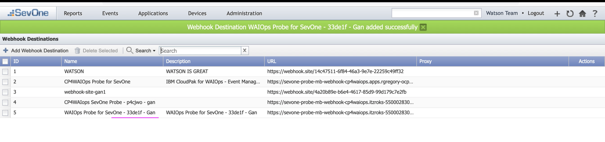

3. Click on `Configure Webhook Destination`.

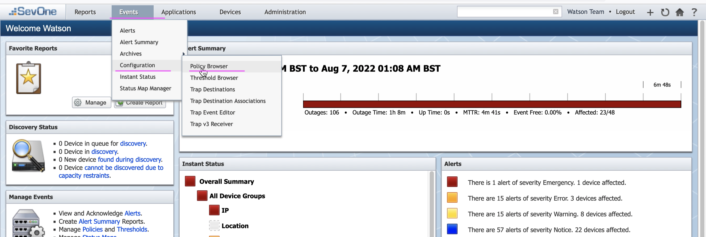

4. Click on `Add Webhook Destination`.

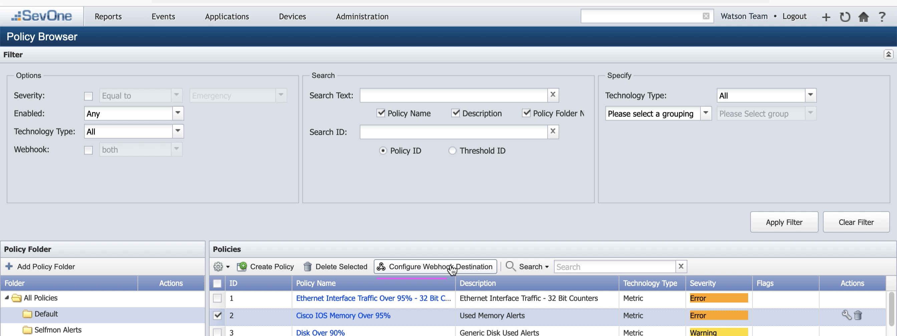

5. Enter the below values

- Name            : Watson AIOps Probe for SevOne
- Description     : Watson AIOps Probe for SevOne
- URL             : Refer the WEBHOOK_URL value printed during the SevOne Probe installation above
- Use Basic Auth  : Check it
- Username        : Refer the WEBHOOK_USER value printed during the SevOne Probe installation above
- Password        : Refer the WEBHOOK_PASSWORD value printed during the SevOne Probe installation above

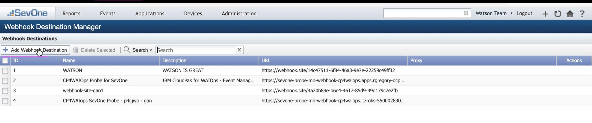

6. The webhook is saved.

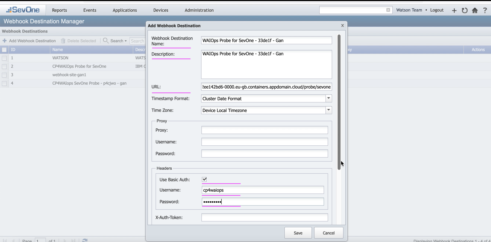

## 3. Create SevOne Policy

This section explains about how to create and configure SevOne Policy in SevOne to forward events /alerts to the WAIOps Probe for SevOne

### 3.1. Create Trigger Conditions

1. In SevOne Console, click on `Events > Configuration > Policy Browser` to open the Policy Browser.


2. Choose any one of the policies

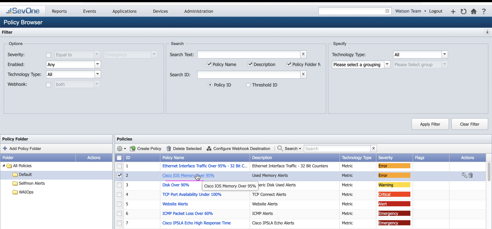

3. Choose `Trigger Conditions` tab.

3. **Method** : Choose `POST` method

4. **Webhook Destinations** : Move the created webhook to the right side.

5. **BODY** : Copy the content from [IBM Doc](https://www.ibm.com/docs/en/cloud-paks/cloud-pak-watson-aiops/3.5.1?topic=integration-probe-sevone-npm-ai-manager) Section 5 (Trigger conditions).

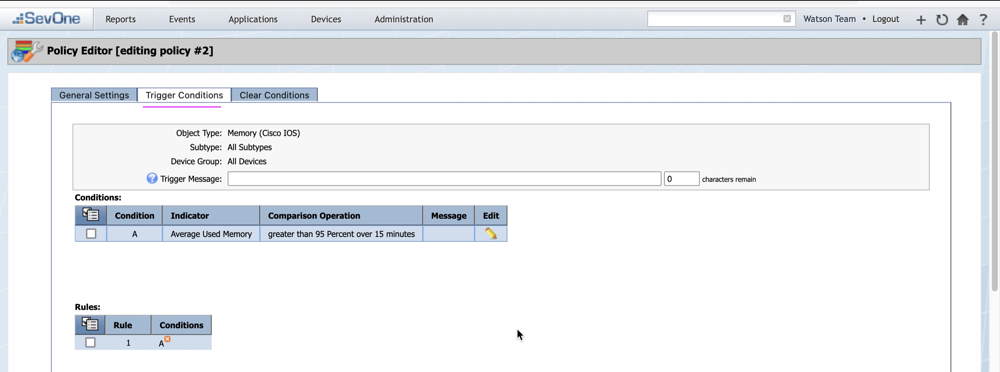
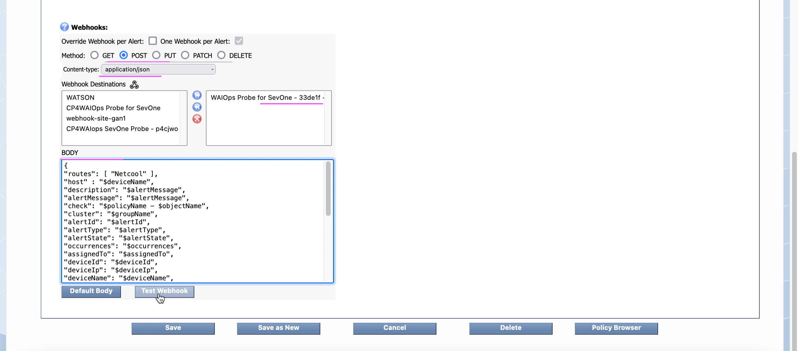

6. Click on `Test WebHook`. It should have sent the test event to WAIOps

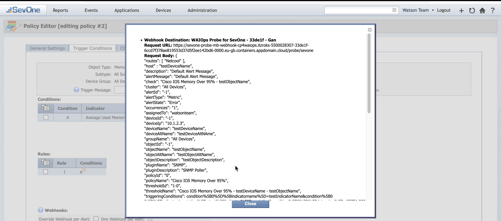

7. View test Event as Alert in WAIOps

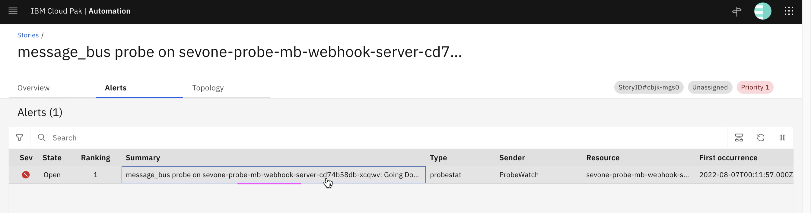

8. View that Alert as a story in WAIOps

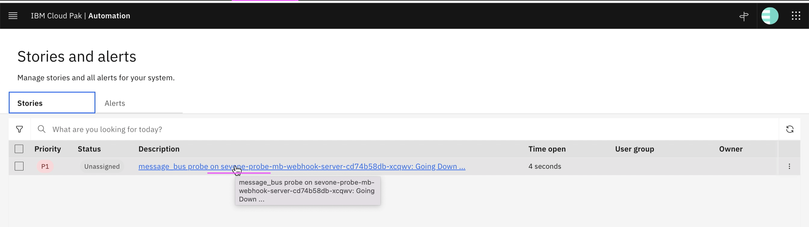

### 3.2. Create Clear Conditions

1. Choose `Clear Conditions` tab.

3. **Method** : Choose `POST` method

4. **Webhook Destinations** : Move the created webhook to the right side.

5. **BODY** : Copy the content from [IBM Doc](https://www.ibm.com/docs/en/cloud-paks/cloud-pak-watson-aiops/3.4.1?topic=integration-probe-sevone-npm-ai-manager) Section 5 (Clear conditions).

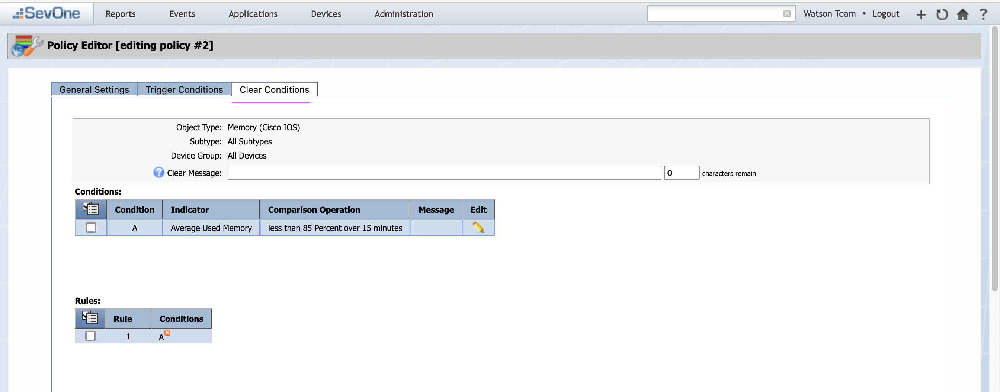
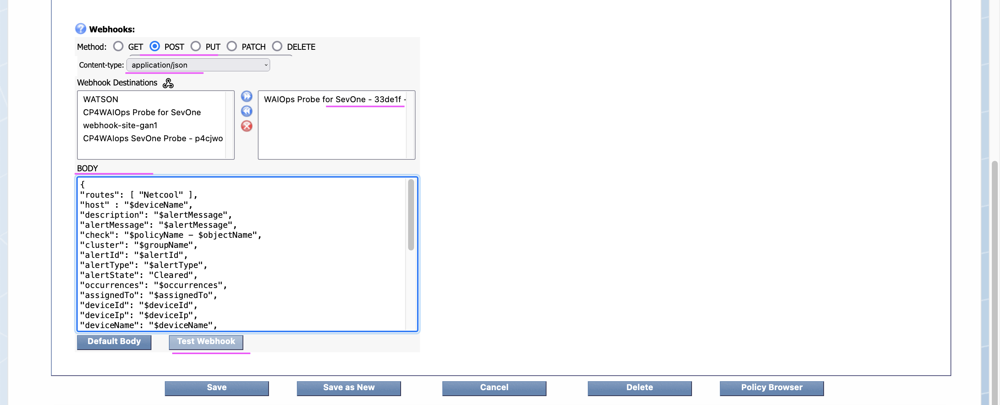

6. Click on `Test WebHook`. It should have sent the clear event to WAIOps

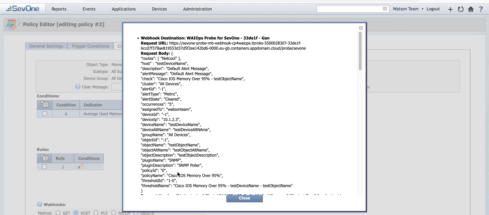

7. View the Alert in WAIOps in Clear Status

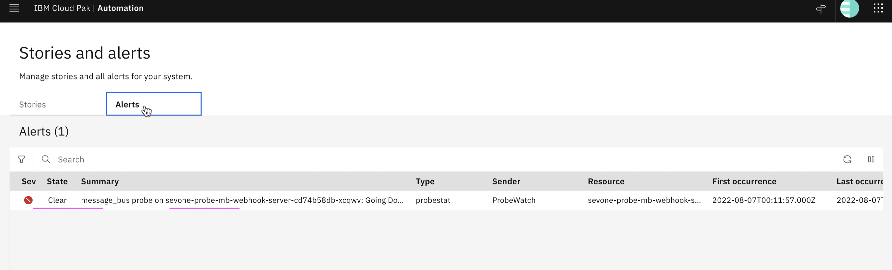

8. View the Story in WAIOps in Resolved Status

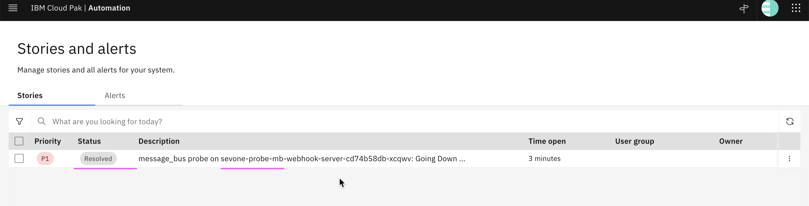

## Reference

This is based out of the following IBM documentations.

https://www.ibm.com/docs/en/cloud-paks/cloud-pak-watson-aiops/3.5.1?topic=integration-probe-sevone-npm-ai-manager
